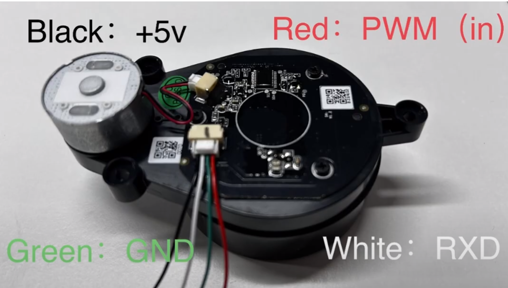
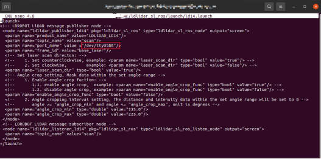

# Smashbot
## Installation instructions:
### Download and install Jetson Nano SD card image from NVIDIA:
Get Started With Jetson Nano Developer Kit | NVIDIA Developer

Username: nanouser

Password: nanouser

Hostname: ubuntunano

Follow instructions from:

GitHub - overclock98/Jetson_Nano_true_Headless_setup_without_hdmi_display: Jetson Nano headless fresh setup(WiFi, SSH and VNC) without a HDMI Display

> https://github.com/overclock98/Jetson_Nano_true_Headless_setup_without_hdmi_display

Connect to Jetson via Micro-USB cable using MobaXterm

Set up WLAN dongle

Connect to Wifi

SSH to board using host ubuntunano.local

Setup systemd to not start GUI in ubuntu:

- sudo systemctl enable multi-user.target --force

- sudo systemctl set-default multi-user.target

> From <https://askubuntu.com/questions/16371/how-do-i-disable-x-at-boot-time-so-that-the-system-boots-in-text-mode> 

### Install lidar following instructions:
FHL- LD20 | youyeetoo wiki：

You need to replace launch file with: https://wiki.youyeetoo.com/en/Lidar/LD20

GitHub - ldrobotSensorTeam/ldlidar_ros: LDROBOT LiDAR ROS Package(NEW)

Remake the catkin workspace



### To start rviz in MobaXterm you need to:
How to remotely access RViz running on Linux / Nvidia Jetson from Windows PC over ssh/x.11? - Open Discussions - The Construct ROS Community (robotigniteacademy.com)
> https://get-help.robotigniteacademy.com/t/how-to-remotely-access-rviz-running-on-linux-nvidia-jetson-from-windows-pc-over-ssh-x-11/17579/3

Install camera:


- Sudo apt install v4l-utils


List your hardware devices:

nanouser@ubuntunano:~$ v4l2-ctl --list-devices

USB Camera (usb-70090000.xusb-2.3):

 /dev/video0
 
Pytorch for Jetson:

PyTorch for Jetson - Jetson & Embedded Systems / Jetson Nano - NVIDIA Developer Forums
> https://forums.developer.nvidia.com/t/pytorch-for-jetson/72048

Jetpack version:

```

nanouser@ubuntunano:~$ sudo apt-cache show nvidia-jetpack
Package: nvidia-jetpack
Version: 4.5.1-b17
Architecture: arm64
Maintainer: NVIDIA Corporation
Installed-Size: 194
Depends: nvidia-cuda (= 4.5.1-b17), nvidia-opencv (= 4.5.1-b17), nvidia-cudnn8 (= 4.5.1-b17), nvidiatensorrt (= 4.5.1-b17), nvidia-visionworks (= 4.5.1-b17), nvidia-container (= 4.5.1-b17), nvidia-vpi (= 
4.5.1-b17), nvidia-l4t-jetson-multimedia-api (>> 32.5-0), nvidia-l4t-jetson-multimedia-api (<< 32.6-0)
Homepage: http://developer.nvidia.com/jetson
Priority: standard
Section: metapackages
Filename: pool/main/n/nvidia-jetpack/nvidia-jetpack_4.5.1-b17_arm64.deb
Size: 29390
SHA256: 13c10e9a53ec51c261ce188d626966dfca27f26b2ed94ba700147c1ba3e35399
SHA1: 81047a7779241bbf16763dbd1c4c12cf8c9d0496
MD5sum: 54916439514f39af5234b3a43e329910
Description: NVIDIA Jetpack Meta Package
Description-md5: ad1462289bdbc54909ae109d1d32c0a8

```
```
Package: nvidia-jetpack
Version: 4.5-b129
Architecture: arm64
Maintainer: NVIDIA Corporation
Installed-Size: 194
Depends: nvidia-cuda (= 4.5-b129), nvidia-opencv (= 4.5-b129), nvidia-cudnn8 (= 4.5-b129), nvidiatensorrt (= 4.5-b129), nvidia-visionworks (= 4.5-b129), nvidia-container (= 4.5-b129), nvidia-vpi (= 4.5-
b129), nvidia-l4t-jetson-multimedia-api (>> 32.5-0), nvidia-l4t-jetson-multimedia-api (<< 32.6-0)
Homepage: http://developer.nvidia.com/jetson
Priority: standard
Section: metapackages
Filename: pool/main/n/nvidia-jetpack/nvidia-jetpack_4.5-b129_arm64.deb
Size: 29358
SHA256: 9ee354a66d932a3fbb244c926f333143a845c627c6981d108e01df2958ac462c
SHA1: 0e07f27c6fb9e34a70c69ae1150d1e578e938089
MD5sum: a551bbc8ff653c8983ce1804082bbcab
Description: NVIDIA Jetpack Meta Package
Description-md5: ad1462289bdbc54909ae109d1d32c0a8
```

Yolo:

ROS Melodic & YOLO - ROS Answers: Open Source Q&A Forum
> https://answers.ros.org/question/364417/ros-melodic-yolo/
